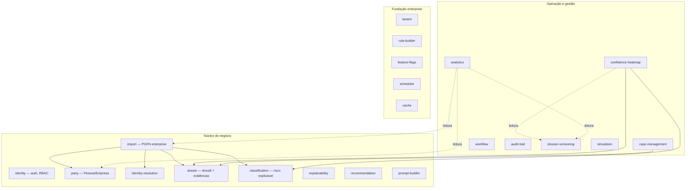
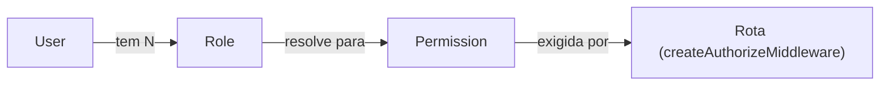
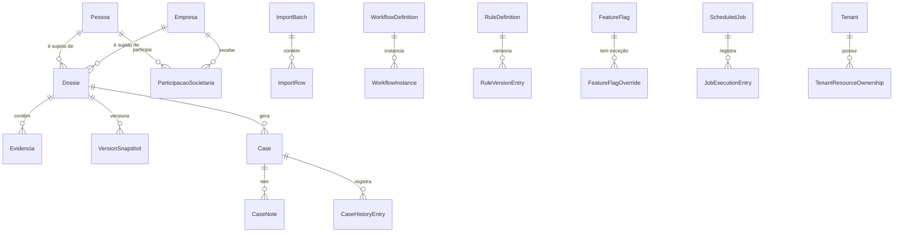

# Visão geral da arquitetura

> Este documento descreve o estado atual da plataforma: 20 módulos de negócio em Clean Architecture, RBAC granular, auditoria e versionamento de dossiê integrados desde a origem. Para o _porquê_ de cada decisão, ver as [ADRs](decisions/) — este documento é o mapa, as ADRs são a justificativa.

## Camadas (`apps/api/src`, replicadas dentro de cada módulo)

```
presentation ──▶ application ──▶ domain
      ▲                 ▲
      │                 │
infrastructure ─────────┘
      (implementa os ports definidos em application/domain)

container: conhece infrastructure (concreto) + application (ports) e injeta um no outro.
main.ts: só chama container.buildContainer() e sobe o servidor HTTP.
```

- **domain** não importa nada de fora dele (nem de outro módulo). Entidades, value objects, serviços de domínio puros, erros de domínio.
- **application** só importa `domain` (do mesmo módulo). Use cases e os _ports_ que a infraestrutura implementa.
- **infrastructure** implementa interfaces de `domain`/`application`; nunca o contrário. Prisma, Redis, geradores de ID, relógio.
- **presentation** importa `application` para chamar use cases; recebe instâncias já montadas pelo `container`. Controllers, rotas Express, validação Zod.
- **container** é o único arquivo, por módulo, que conhece tanto os ports quanto as implementações concretas — a composição manual de dependências (sem framework de DI, ver [ADR 0003](decisions/0003-manual-dependency-injection.md)).

Essa regra é verificada automaticamente pelo ESLint (`eslint-plugin-boundaries`) — ver [ADR 0009](decisions/0009-lint-enforced-architecture-boundaries.md). Nenhum módulo importa a camada `infrastructure` de outro módulo; cada módulo reconstrói suas próprias instâncias de regras/serviços compartilhados (duplicação deliberada em vez de acoplamento — ver ADRs 0010/0024/0025/0030) com poucas exceções documentadas explicitamente (`confidence-heatmap`/`analytics` dependem de `dossier-versioning` por leitura, porque fabricar dado histórico seria pior que o acoplamento).

## Mapa de módulos



Setas sólidas = dependência direta (reconstrução de use case, mesmo padrão do ADR 0010). Setas pontilhadas = as únicas exceções documentadas de acoplamento por leitura entre módulos (ADRs 0024/0025). `tenant`, `rule-builder`, `feature-flags`, `scheduler` e `cache` são **fundações standalone**: infraestrutura real e testada, mas sem nenhum módulo de negócio consumindo-as ainda — cada uma tem essa limitação registrada explicitamente na sua ADR (0028/0030/0031/0032), por ser mais honesto documentar a lacuna do que fingir integração que exigiria alterar módulos já aprovados.

## Fluxo de uma requisição autenticada (`GET /api/v1/cases`)

```
Request
  → requestIdMiddleware        (gera/propaga X-Request-Id)
  → securityHeadersMiddleware  (Helmet)
  → corsMiddleware
  → express.json()
  → httpLoggerMiddleware       (loga método, path, status, duração)
  → metricsMiddleware          (Prometheus: contador + histograma por rota)
  → auditTrailMiddleware       (observa a rota; grava evento de auditoria no fire-and-forget)
  → versionSnapshotMiddleware  (observa rotas de dossiê; snapshot de versão se aplicável)
  → resolveTenantMiddleware    (lê X-Tenant-Id, popula req.tenantId — nunca bloqueia)
  → rateLimitMiddleware        (Redis-backed)
  → router /api/v1/cases
  → authenticateMiddleware     (valida JWT, popula req.auth)
  → authorizeMiddleware("case:read")  (RBAC — nega por padrão)
  → CaseController.list
  → ListCasesUseCase.execute() → ICaseRepository.findMany()
  → res.json(CasePage)

Se qualquer middleware/controller chamar next(err):
  → notFoundMiddleware (rota inexistente) ou erro lançado
  → errorHandlerMiddleware → loga + responde ApiErrorResponse padronizado ({ error: { kind, message, details }, requestId })
```

## RBAC — modelo de autorização



- **Papéis** (`Role`, enum fechado em código): `ADMIN`, `ANALYST`, `MANAGER`, `COLLECTOR`, `AUDITOR`, `VIEWER`.
- **Permissões** (`Permission`, string granular por recurso+operação, ex.: `case:write`, `rule:read`): nunca checadas por nome de papel — sempre por permissão (Interface Segregation aplicada a autorização).
- `RolePermissionPolicy.hasPermission(roles, permission)` resolve a união de permissões de todos os papéis de um usuário — puro, sem I/O, chamado a cada requisição sem custo de banco.
- **Deny-by-default**: uma rota sem `createAuthorizeMiddleware` explícito não está "aberta por engano" — ela está fora do escopo desta rodada de RBAC (ver limitação abaixo).
- **Limitação conhecida e documentada** ([ADR 0029](decisions/0029-rbac-enterprise.md)): RBAC granular cobre os módulos construídos nas Etapas 5–14; a baseline original (identity, party, dossie, classification, recommendation, prompt-builder, import) e as Etapas 1–4 (explainability, audit-trail, dossier-versioning, simulation) exigem apenas autenticação, não permissão granular — aplicar RBAC retroativamente ali é backlog explícito, não uma omissão silenciosa. Além disso, `VIEWER` está pinado em zero permissões por um teste existente que não pode ser alterado — também documentado na mesma ADR.

## Multi-tenant — modelo de isolamento

`TenantResourceOwnership(resourceType, resourceId)` com `@@unique` é a garantia real: um recurso nunca tem dois donos ao mesmo tempo, e `TenantPolicy.podeAcessar` é fail-closed (sem registro de propriedade, nenhum tenant acessa). O módulo `tenant` não conhece nenhum outro módulo — `resourceType`/`resourceId` são strings livres. Ver [ADR 0028](decisions/0028-multi-tenant-foundation.md) para por que isso é uma fundação aditiva, não um retrofit sobre tabelas existentes.

## Modelo de dados — agregados principais



## Explicabilidade — princípio transversal

Nenhum módulo de decisão (`classification`, `recommendation`, `confidence-heatmap`, `rule-builder`) devolve um veredito sem o motivo. Toda resposta de classificação inclui os fatores que a geraram; toda regra casada no `rule-builder` inclui as condições que satisfez; todo heatmap de confiança mostra a fonte e a contribuição percentual de cada evidência. Isso não é um endpoint de auditoria separado — é parte do contrato de resposta normal.

## Observabilidade

- **Logs estruturados** (Pino) — todo request logado com `requestId`, método, path, status, duração; redaction automática de campos sensíveis (senha, token, CPF completo nunca aparecem em log).
- **Métricas Prometheus** (`GET /api/v1/metrics`) — `http_requests_total` e `http_request_duration_seconds` por método/rota/status, mais métricas padrão do processo Node (heap, event loop, GC).
- **Auditoria** (`audit-trail`, append-only) — toda mutação relevante do sistema gera um evento correlacionável pelo mesmo `requestId` do log.
- **Health check** (`GET /api/v1/health`) — Postgres (`SELECT 1`) e Redis (`PING`), com latência.

## Documentação da API

`GET /api/v1/docs` (Swagger UI) e `GET /api/v1/openapi.json` — cobre todos os ~95 endpoints, com segurança, parâmetros e forma de request/response.

## Por que cada pasta existe (dentro de um módulo)

- `domain/{entities,value-objects,repositories,errors,services}` — regras de negócio puras, sem I/O.
- `application/{use-cases,ports}` — orquestração e contratos para o mundo externo.
- `infrastructure/{persistence,...}` — implementações concretas: Prisma, Redis, geradores de ID, relógio.
- `presentation/{controllers,routes,validators}` — camada Express + Zod.
- `container.ts` — composition root do módulo.
